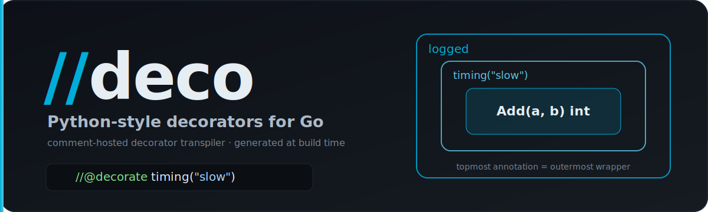

<p align="center">
  
</p>

<p align="center">
  <a href="https://pkg.go.dev/github.com/paulmanoni/deco"></a>
  <a href="LICENSE"></a>
</p>

# deco

Python-style decorators for Go, via code generation. Annotate any function with
a doc comment and `deco` wraps it — every caller of the original name
transparently flows through your decorators.

```go
//@decorate logged
//@decorate timing("slow")
func Add(a, b int) int { return a + b }
```

```sh
deco run .
# [log] -> calling func(int, int) int
# [time] slow took 21µs
# [log] <- returned from func(int, int) int
# Add(2, 3) = 5
```

## Install

```sh
go install github.com/paulmanoni/deco@latest
```

## Commands

```sh
deco run [dir]        # run the program with decorators applied (source untouched)
deco build [dir]      # build it
deco generate [dir]   # write the generated wrappers to disk instead
```

`dir` defaults to `.` and may also be a `.go` file. `run` and `build` use Go's
`-overlay`, so your source files are never modified; `generate` writes
`<file>_gen.go` files next to your code.

## Creating a custom decorator

A decorator is a generic function that takes the wrapped function and returns
one of the **same type**. Build it with `decorators.Func` — you write plain
middleware, no reflection:

```go
import "github.com/paulmanoni/deco/decorators"

func logged[F any](fn F) F {
	return decorators.Func(fn, func(proceed func()) {
		fmt.Println("-> start")
		proceed()          // runs the wrapped function
		fmt.Println("<- done")
	})
}
```

Call `proceed()` where you like:

```go
// timing — a decorator that takes an argument (passed BEFORE the function)
func timing[F any](label string, fn F) F {
	return decorators.Func(fn, func(proceed func()) {
		start := time.Now()
		proceed()
		fmt.Printf("%s took %s\n", label, time.Since(start))
	})
}

// retry — call proceed() more than once
func retry[F any](n int, fn F) F {
	return decorators.Func(fn, func(proceed func()) {
		for i := 0; i < n; i++ {
			ok := func() (ok bool) { defer func() { ok = recover() == nil }(); proceed(); return }()
			if ok { return }
		}
	})
}

// guard — don't call proceed() to short-circuit (returns the zero value)
func guard[F any](allowed bool, fn F) F {
	return decorators.Func(fn, func(proceed func()) {
		if allowed { proceed() }
	})
}
```

`decorators.Func` works for **any** signature — multiple returns, no returns,
variadics — and runs the reflection once.

### Request-aware decorators (reading args & results)

When a decorator needs to *read or modify* the arguments or return values — e.g.
auth middleware that inspects the `*http.Request` — use `decorators.FuncValues`.
It exposes args and results as `[]any`:

```go
// RequireRole denies the request (403) and skips the handler unless the
// X-Role header matches. It pulls the ResponseWriter and *http.Request out of
// the handler's arguments — no matter the exact handler signature.
func RequireRole[F any](role string, fn F) F {
	return decorators.FuncValues(fn, func(args []any, proceed func([]any) []any) []any {
		var w http.ResponseWriter
		var r *http.Request
		for _, a := range args {
			switch v := a.(type) {
			case http.ResponseWriter:
				w = v
			case *http.Request:
				r = v
			}
		}
		if r == nil || r.Header.Get("X-Role") != role {
			if w != nil {
				w.WriteHeader(http.StatusForbidden)
				fmt.Fprintf(w, "forbidden: need role %q\n", role)
			}
			return nil // short-circuit: the handler never runs
		}
		return proceed(args) // authorised → run the handler
	})
}
```

Use it like any other decorator:

```go
//@decorate middleware.RequireRole("admin")
func Users(w http.ResponseWriter, r *http.Request) { ... }
```

`proceed(args)` runs the wrapped function (pass modified args to rewrite them);
returning your own values replaces the results; not calling it short-circuits.
This is exactly the middleware in `./examples/router`.

## Using decorators

Annotate a function. Decorators **stack bottom-up**: the topmost annotation is
the outermost wrapper.

```go
//@decorate logged          // outermost
//@decorate timing("slow")  // innermost
func Add(a, b int) int { return a + b }
```

- **Bare name** (`//@decorate logged`) — resolves to a decorator in the same
  package.
- **Qualified name** (`//@decorate mw.Logged`) — a decorator from another
  package. deco finds the package automatically (it matches `mw` against your
  module's packages via `go list`), so this usually just works:

  ```go
  //@decorate mw.Logged
  //@decorate mw.RequireRole("admin")
  func Handler(w http.ResponseWriter, r *http.Request) { ... }
  ```

  Add a `//deco:import` directive only when auto-resolution can't decide — an
  ambiguous package name, or a decorator in an external module that nothing in
  your code imports:

  ```go
  //deco:import "github.com/you/mw"           // or: //deco:import alias "github.com/you/mw"
  ```

Then `deco run .` (or `build` / `generate`). That's it — callers of `Add` or
`Handler` now go through the decorators.

## Examples

```sh
deco run ./example          # three different signatures, each decorated
deco run ./examples/router  # multi-package HTTP router; the router itself is a decorator
```

`./examples/router` shows the Flask `@app.route` pattern (annotating a handler
with `//@decorate routing.Route("GET", "/users")` registers it) **and** the
request-aware `RequireRole` middleware above:

```
$ deco run ./examples/router
GET /health                 → 200 ok
GET /users                  → [mw] auth: DENY   → 403 forbidden: need role "admin"
GET /users  (X-Role: admin) → [mw] auth: allow  → 200 users: alice, bob
```

Without the header the handler never runs; `RequireRole` short-circuits with a
403. With it, the request flows through to the handler.

## API

deco ships two importable packages. Full reference on
[pkg.go.dev](https://pkg.go.dev/github.com/paulmanoni/deco).

### `…/transpiler` — run the transpiler from Go (no CLI)

| function | what it does |
|----------|--------------|
| `Generate(dir string) error` | rename originals and write `<file>_gen.go` across the package tree |
| `Transform(dir string) ([]Output, error)` | the same generation, returned in memory — no writes |
| `Overlay(dir string) (path string, cleanup func(), err error)` | write a `go build -overlay` JSON; source left untouched |

```go
import "github.com/paulmanoni/deco/transpiler"

if err := transpiler.Generate("./mypkg"); err != nil { ... }
```

Or wire it into `go generate` without installing the binary:

```go
//go:generate go run github.com/paulmanoni/deco generate .
```

### `…/decorators` — helpers for writing decorators

| function | what it does |
|----------|--------------|
| `Func[F any](fn F, mw func(proceed func())) F` | wrap a call as middleware — call `proceed()` to run it |
| `FuncValues[F any](fn F, mw func(args []any, proceed func([]any) []any) []any) F` | request-aware: read or modify the arguments and results |
| `Logged[F any](fn F) F` | example decorator — logs entry and exit |
| `Timing[F any](label string, fn F) F` | example decorator — measures duration |

All are generic and signature-preserving; `Func`/`FuncValues` do the reflection
for you so your decorators contain none.

## Performance

`decorators.Func`/`FuncValues` are signature-agnostic via reflection, so a
decorated call costs more than a direct one. Indicative numbers (Apple M-series,
`go test -bench . ./decorators/`):

| decorator | ns/op | allocs/op |
|-----------|------:|----------:|
| raw function (none) | ~2 | 0 |
| **concrete, typed decorator** | **~2** | **0** |
| one `Func` layer | ~310 | 7 |
| three stacked `Func` layers | ~970 | 21 |
| `FuncValues` (args/results boxed) | ~385 | 10 |

For I/O-bound work (HTTP handlers, etc.) the reflection cost is negligible.

**Want it faster?** deco generates plain Go and calls whatever decorator you
name — it doesn't *require* reflection. For a hot path, write a decorator
specialised to the function's signature instead of using `decorators.Func`:

```go
// reflection-free → ~2 ns/op, 0 allocs (same as a raw call)
func logged(fn func(int, int) int) func(int, int) int {
	return func(a, b int) int { log.Print("call"); return fn(a, b) }
}
```

The generated wrapper calls it directly, so there's no runtime reflection. The
trade-off is generality: a typed decorator works for one signature shape, while
`Func` works for all. Other levers: keep chains shallow, and decorate coarse
entry points — a recursive decorated function re-enters the chain on every
self-call (`Fact(20)`: ~16ns → ~6.7µs), so don't decorate a hot recursive
helper.

## Notes

- Decorators are applied once, at package init (like Python's `fn = a(b(fn))`).
- Methods (functions with receivers) are not supported in v1.
- Use `decorators.Func` to wrap a call, or `decorators.FuncValues` when you need
  to read or modify the arguments/return values. Both avoid hand-written
  reflection.

## Changelog

See [CHANGELOG.md](CHANGELOG.md) for the release history.

## License

[MIT](LICENSE) © Paul Manoni
