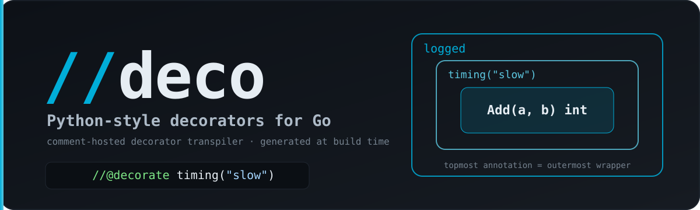

<p align="center">
  
</p>

<p align="center">
  <a href="https://pkg.go.dev/github.com/paulmanoni/deco"></a>
  <a href="LICENSE"></a>
</p>

# deco

Python-style decorators for Go, via code generation. Annotate any function or
method with a doc comment and `deco` wraps it — every caller of the original
name transparently flows through your decorators.

```go
//deco:wrap logged
//deco:wrap timing("slow")
func Add(a, b int) int { return a + b }
```

The `//deco:wrap` directive uses Go's own `//tool:directive` comment form
(like `//go:embed`), so gofmt never rewrites it. The Python-flavoured
`//@decorate` spelling is accepted as an alias everywhere.

```sh
deco run .
# [log] -> calling func(int, int) int
# [time] slow took 21µs
# [log] <- returned from func(int, int) int
# Add(2, 3) = 5
```

## Install

```sh
go install github.com/paulmanoni/deco@latest
```

## deco as a go wrapper

Run `deco <cmd>` anywhere you'd run `go <cmd>`. deco transpiles your decorators
into an overlay and then **hands off to the real `go` toolchain** — it never
reimplements go behavior, so flags, exit codes, and output are exactly go's.

```sh
deco build ./...            # = go build with decorators applied
deco run .                  # = go run .   (reads stdin, streams output)
deco test -race ./...       # = go test -race ./...
deco vet ./...              # = go vet ./...
deco install ./cmd/foo      # = go install ./cmd/foo
```

- The compile/run subcommands (`build run test vet install list`) get deco's
  `-overlay`, so **your source files are never modified**.
- Any other subcommand (`env`, `version`, `mod`, …) is forwarded verbatim with
  no overlay — including future go subcommands.
- All flags and packages are passed through untouched, the child inherits your
  environment and working directory, and **deco exits with the child's exact
  exit code** (so a failing `deco test` fails CI).

deco's own flags go **before** the subcommand (single-dash, go style):

```sh
deco -annotation "@wrap" test ./...   # accept //@wrap as the alias keyword
```

`deco generate [dir]` is the one non-wrapper command: it writes `<file>_gen.go`
to disk instead of using an overlay. It speaks gofmt's flag vocabulary:

```sh
deco generate ./...        # write wrappers to disk (the default)
deco generate -l ./...     # list files whose generated content differs; write nothing
deco generate -d ./...     # print unified diffs; write nothing
deco generate -l -w ./...  # list AND write (flags combine, like gofmt)
```

`-l` doubles as a CI drift gate, the same way `gofmt -l` does:

```sh
test -z "$(deco generate -l .)"
```

> **Positions:** `vet`/`test`/`build` run against the *transpiled* overlay, but
> deco **remaps diagnostic positions back to your source** — both compiler/vet
> diagnostics (stderr) and `go test` failure messages and panic stacks (stdout).
> A finding in a decorated function reports the same `file:line` as bare `go`,
> not a temp overlay path. The exception is a position in a generated wrapper
> (`*_gen.go`), which has no source equivalent; deco shows the logical
> `*_gen.go` path and prints a note. Machine output (`-json`) is passed through
> verbatim. See [`examples/remap-demo`](examples/remap-demo) for a runnable
> demonstration.

## Creating a custom decorator

A decorator is a generic function that takes the wrapped function and returns
one of the **same type**. Build it with `decorators.Func` — you write plain
middleware, no reflection:

```go
import "github.com/paulmanoni/deco/decorators"

func logged[F any](fn F) F {
	return decorators.Func(fn, func(proceed func()) {
		fmt.Println("-> start")
		proceed()          // runs the wrapped function
		fmt.Println("<- done")
	})
}
```

Call `proceed()` where you like:

```go
// timing — a decorator that takes an argument (passed BEFORE the function)
func timing[F any](label string, fn F) F {
	return decorators.Func(fn, func(proceed func()) {
		start := time.Now()
		proceed()
		fmt.Printf("%s took %s\n", label, time.Since(start))
	})
}

// retry — call proceed() more than once
func retry[F any](n int, fn F) F {
	return decorators.Func(fn, func(proceed func()) {
		for i := 0; i < n; i++ {
			ok := func() (ok bool) { defer func() { ok = recover() == nil }(); proceed(); return }()
			if ok { return }
		}
	})
}

// guard — don't call proceed() to short-circuit (returns the zero value)
func guard[F any](allowed bool, fn F) F {
	return decorators.Func(fn, func(proceed func()) {
		if allowed { proceed() }
	})
}
```

`decorators.Func` works for **any** signature — multiple returns, no returns,
variadics — and runs the reflection once.

### Middleware factories — fuse the stack (fast path)

Each `Func`-built decorator is its own reflective layer, so a stack pays per
decorator. Write the decorator as a **factory** instead — return the
middleware rather than wrapping the function:

```go
func logged() decorators.Middleware {
	return func(proceed func()) {
		fmt.Println("-> start")
		proceed()
		fmt.Println("<- done")
	}
}

func timing(label string) decorators.Middleware {
	return func(proceed func()) {
		start := time.Now()
		proceed()
		fmt.Printf("%s took %s\n", label, time.Since(start))
	}
}
```

The annotations don't change. deco detects the shape from the signature
(exactly the leading args, single `decorators.Middleware` result), and:

- a stack that is **all factories** compiles to a reflection-free wrapper —
  a `[]decorators.Middleware` built at init and run over a typed call
  (`decorators.Run(addMWs, func() { r0 = addImpl(a, b) })`): ~50 ns for a
  3-deep stack instead of ~900 ns;
- a **mixed** stack fuses each run of consecutive factories into one
  reflective layer via `decorators.Chain(inner, f1(), f2())`, with wrap-style
  decorators nesting around it as before.

`proceed` semantics are identical to `Func`: call it zero times to
short-circuit (zero values), once to run, more than once to retry — a repeated
`proceed()` re-runs everything downstream. Detection works across packages:
deco reads the decorator's defining package (in your module or any dependency)
to classify it, so `//deco:wrap mw.Traced` from a shared middleware library
fuses exactly like a same-package factory.

### Request-aware decorators (reading args & results)

When a decorator needs to *read or modify* the arguments or return values — e.g.
auth middleware that inspects the `*http.Request` — use `decorators.FuncValues`.
It exposes args and results as `[]any`:

```go
// RequireRole denies the request (403) and skips the handler unless the
// X-Role header matches. It pulls the ResponseWriter and *http.Request out of
// the handler's arguments — no matter the exact handler signature.
func RequireRole[F any](role string, fn F) F {
	return decorators.FuncValues(fn, func(args []any, proceed func([]any) []any) []any {
		var w http.ResponseWriter
		var r *http.Request
		for _, a := range args {
			switch v := a.(type) {
			case http.ResponseWriter:
				w = v
			case *http.Request:
				r = v
			}
		}
		if r == nil || r.Header.Get("X-Role") != role {
			if w != nil {
				w.WriteHeader(http.StatusForbidden)
				fmt.Fprintf(w, "forbidden: need role %q\n", role)
			}
			return nil // short-circuit: the handler never runs
		}
		return proceed(args) // authorised → run the handler
	})
}
```

Use it like any other decorator:

```go
//deco:wrap middleware.RequireRole("admin")
func Users(w http.ResponseWriter, r *http.Request) { ... }
```

`proceed(args)` runs the wrapped function (pass modified args to rewrite them);
returning your own values replaces the results; not calling it short-circuits.
This is exactly the middleware in `./examples/router`.

## Using decorators

Annotate a function. Decorators **stack bottom-up**: the topmost annotation is
the outermost wrapper.

```go
//deco:wrap logged          // outermost
//deco:wrap timing("slow")  // innermost
func Add(a, b int) int { return a + b }
```

- **Bare name** (`//deco:wrap logged`) — resolves to a decorator in the same
  package.
- **Qualified name** (`//deco:wrap mw.Logged`) — a decorator from another
  package: one of your module's packages, or an **external library** where
  `go get` alone is enough (deco matches `mw` against your module's packages,
  then your go.mod's direct dependencies — no import statement anywhere and
  no directive needed). It reads the package's source to arity-check the
  reference and to fuse middleware factories, so this usually just works:

  ```go
  //deco:wrap mw.Logged
  //deco:wrap mw.RequireRole("admin")
  func Handler(w http.ResponseWriter, r *http.Request) { ... }
  ```

  Add a `//deco:import` directive only when auto-resolution can't decide —
  several packages in scope share the name, or the decorator lives in an
  indirect dependency:

  ```go
  //deco:import "github.com/you/mw"           // or: //deco:import alias "github.com/you/mw"
  ```

Then `deco run .` (or `build` / `generate`). That's it — callers of `Add` or
`Handler` now go through the decorators.

### Methods

Methods decorate exactly like functions — pointer or value receiver, exported
or not:

```go
type Counter struct{ total int }

//deco:wrap logged
func (c *Counter) Add(n int) int { c.total += n; return c.total }
```

Under the hood the chain is built over the **method expression** —
`logged((*Counter).addImpl)` — a plain function value whose first parameter is
the receiver. So every function decorator works on methods unchanged:
`decorators.Func` sees one extra leading argument (the receiver), and a
request-aware `decorators.FuncValues` middleware finds the receiver at
`args[0]`. The generated wrapper is a real method with the original signature,
so interface satisfaction is preserved.

The one exclusion is a **generic receiver** (`func (b *Box[T]) …`): a type
parameter prevents the package-level method expression, and deco reports a
clear `file:line` error.

## Examples

```sh
deco run ./example          # different signatures + decorated methods
deco run ./examples/router  # multi-package HTTP router; the router itself is a decorator
```

`./examples/router` shows the Flask `@app.route` pattern (annotating a handler
with `//deco:wrap routing.Route("GET", "/users")` registers it) **and** the
request-aware `RequireRole` middleware above:

```
$ deco run ./examples/router
GET /health                 → 200 ok
GET /users                  → [mw] auth: DENY   → 403 forbidden: need role "admin"
GET /users  (X-Role: admin) → [mw] auth: allow  → 200 users: alice, bob
```

Without the header the handler never runs; `RequireRole` short-circuits with a
403. With it, the request flows through to the handler.

## API

deco ships two importable packages. Full reference on
[pkg.go.dev](https://pkg.go.dev/github.com/paulmanoni/deco).

### `…/transpiler` — run the transpiler from Go (no CLI)

| function | what it does |
|----------|--------------|
| `Generate(dir string, opts ...Option) error` | rename originals and write `<file>_gen.go` across the package tree |
| `Transform(dir string, opts ...Option) ([]Output, error)` | the same generation, returned in memory — no writes |
| `Overlay(dir string, opts ...Option) (path string, cleanup func(), err error)` | write a `go build -overlay` JSON; source left untouched |
| `WithAnnotation(keyword string) Option` | use a custom alias keyword instead of `@decorate` (`//deco:wrap` always works) |

```go
import "github.com/paulmanoni/deco/transpiler"

if err := transpiler.Generate("./mypkg"); err != nil { ... }

// custom alias keyword: recognise //@wrap as well as //deco:wrap
transpiler.Generate("./mypkg", transpiler.WithAnnotation("@wrap"))
```

Or wire it into `go generate` without installing the binary:

```go
//go:generate go run github.com/paulmanoni/deco generate .
```

### `…/decorators` — helpers for writing decorators

| function | what it does |
|----------|--------------|
| `Func[F any](fn F, mw func(proceed func())) F` | wrap a call as middleware — call `proceed()` to run it |
| `FuncValues[F any](fn F, mw func(args []any, proceed func([]any) []any) []any) F` | request-aware: read or modify the arguments and results |
| `Middleware` (`func(proceed func())`) | the fused decorator shape — return it from a factory to enable fusion |
| `Chain[F any](fn F, mws ...Middleware) F` | run a whole middleware stack inside ONE wrapper layer |
| `Run(mws []Middleware, call func())` | drive a middleware stack over a typed call — no reflection (what fused wrappers use) |
| `Logged[F any](fn F) F` | example decorator — logs entry and exit |
| `Timing[F any](label string, fn F) F` | example decorator — measures duration |

All are generic and signature-preserving; `Func`/`FuncValues` do the reflection
for you so your decorators contain none.

## Performance

`decorators.Func`/`FuncValues` are signature-agnostic via reflection, so a
decorated call costs more than a direct one. Indicative numbers (Apple M-series,
`go test -bench . ./decorators/`):

| decorator | ns/op | allocs/op |
|-----------|------:|----------:|
| raw function (none) | ~2 | 0 |
| **concrete, typed decorator** | **~2** | **0** |
| one `Func` layer | ~285 | 7 |
| three stacked `Func` layers | ~900 | 21 |
| **three factories, fused wrapper (`Run`)** | **~52** | **4** |
| three middleware in one `Chain` layer | ~320 | 9 |
| `FuncValues` (args/results boxed) | ~385 | 10 |

For I/O-bound work (HTTP handlers, etc.) the reflection cost is negligible.

**Want it faster?** Write your decorators as [middleware
factories](#middleware-factories--fuse-the-stack-fast-path): an all-factory
stack costs ~52 ns at ANY depth (no reflection, one boxing-free typed call),
and even a mixed stack pays one reflective layer per factory *run* instead of
per decorator. For the last nanoseconds, write a decorator specialised to the
function's signature instead of using `decorators.Func`:

```go
// reflection-free → ~2 ns/op, 0 allocs (same as a raw call)
func logged(fn func(int, int) int) func(int, int) int {
	return func(a, b int) int { log.Print("call"); return fn(a, b) }
}
```

The generated wrapper calls it directly, so there's no runtime reflection. The
trade-off is generality: a typed decorator works for one signature shape, while
`Func` works for all. Other levers: keep chains shallow, and decorate coarse
entry points — a recursive decorated function re-enters the chain on every
self-call (`Fact(20)`: ~16ns → ~6.7µs), so don't decorate a hot recursive
helper.

## Notes

- deco has **zero dependencies** — the module is stdlib-only, and the code it
  generates depends only on what you already import.
- `//deco:wrap name` is the primary syntax; `//@decorate name` (or a custom
  keyword via `-annotation`) is an alias. Both may appear in the same doc
  comment and stack together.
- Decorators are applied once, at package init (like Python's `fn = a(b(fn))`).
- Generic receivers (`func (b *Box[T]) …`) cannot be decorated — a type
  parameter prevents the package-level method expression the chain is built
  over. Generic *decorators* (the `[F any]` shape) are the normal case and
  unaffected.
- Use `decorators.Func` to wrap a call, or `decorators.FuncValues` when you need
  to read or modify the arguments/return values. Both avoid hand-written
  reflection.

## Changelog

See [CHANGELOG.md](CHANGELOG.md) for the release history.

## License

[MIT](LICENSE) © Paul Manoni
